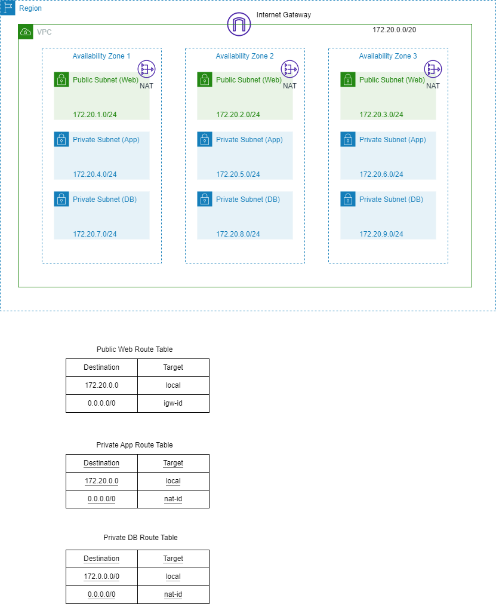
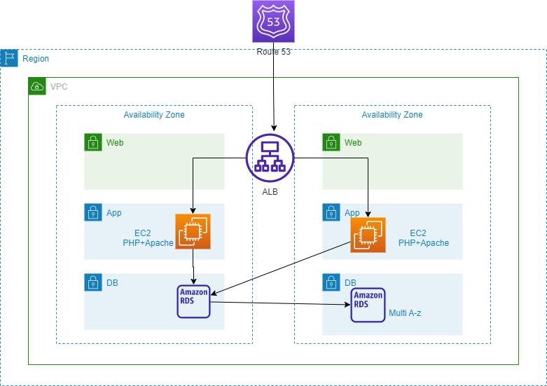

# techChallenge
Technical Challenge AWS

# Challenge1:

A 3-tier environment is a common setup. Use a tool of your choosing/familiarity create these
resources on a cloud environment (Azure/AWS/GCP). Please remember we will not be judged
on the outcome but more focusing on the approach, style and reproducibility.

***************************** Three Tier-Architechture *********************************

***************************** Three Tier Architechture for PHP and Apache ***************************

# Challenge2:

We need to write code that will query the meta data of an instance within AWS or Azure or GCP
and provide a json formatted output.
The choice of language and implementation is up to you.

**aws-metadata-json**

# What it does

Query the metadata of an ec2 instance within AWS and provide a json formatted output.
Retrieve the value of a particular data key.

# How to install
Create an EC2 Linux instance on AWS

SSH into the instance

#### Install Python 3 and git on your instance 

 sudo yum install python3 git

#### Clone this repository

 git clone https://github.com/bluprince13/aws-metadata-json

#### Install pipenv

 sudo pip3 install pipenv

#### Open the repository on your instance

 cd aws-metadata-json

#### Install project dependancies

 pipenv install

# How to run

Open the src folder

 cd techChallenge/src

# Run whichever script you need:

 python3 get_metadata.py

 python3 get_key.py

# Challenge3:

We have a nested object. We would like a function where you pass in the object and a key and
get back the value.
The choice of language and implementation is up to you.
Example Inputs
object = {“a”:{“b”:{“c”:”d”}}}
key = a/b/c
object = {“x”:{“y”:{“z”:”a”}}}
key = x/y/z
value = a

Answer : Code for this is written in pythonNestedCode.py
